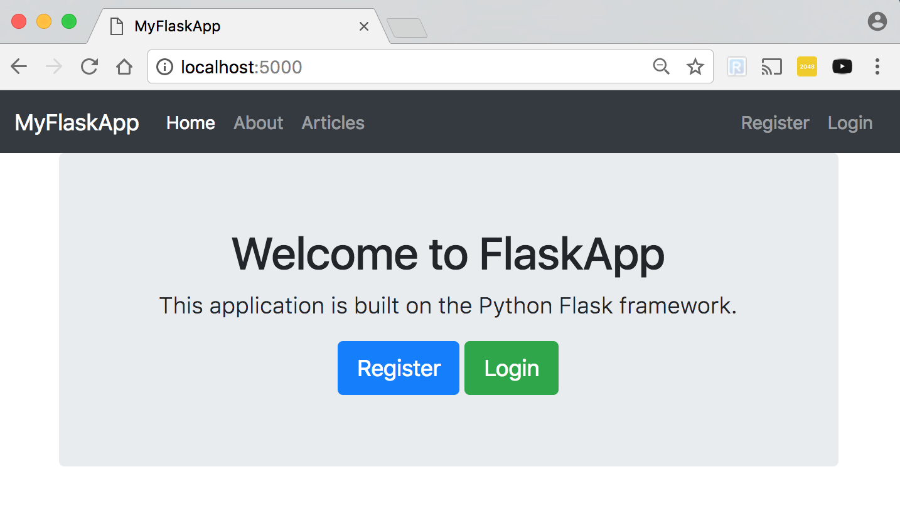

# Flask User Registration Web App

## Usage
### Requirements

### Setting up Docker stack
1. Run startup script - `/bin/bash docker-start.sh`
1. Run DB import script - `/bin/bash docker-importdb.sh`
