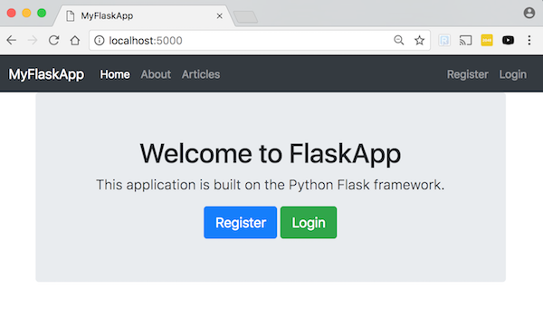

# Flask User Registration Web App



## Build Web Docker Image
`docker build -t flaskuserregistration_web:latest ./docker/web/`

## Bring up Docker stack
`docker-compose -f docker-compose.yml up`

## Find ID of MariaDB container: `docker ps`
```
mny:flask-user-registration (master) docker ps
CONTAINER ID        IMAGE                       COMMAND                  CREATED              STATUS              PORTS                    NAMES
a925dbeb12b8        flaskuserregistration_web   "python3.6 app.py"       About a minute ago   Up About a minute   0.0.0.0:5000->5000/tcp   flaskuserregistration_web_1
67c3d7b18f02        mariadb:10.3.5              "docker-entrypoint.s…"   About a minute ago   Up About a minute   0.0.0.0:3306->3306/tcp   flaskuserregistration_db_1
```

## Import SQL Dump
`cat dbcreation.sql | docker exec -i [MARIADB_CONTAINER_ID] /usr/bin/mysql -uroot -proot myflaskapp`
